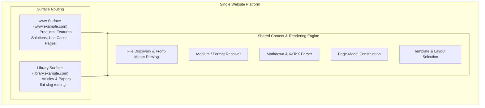
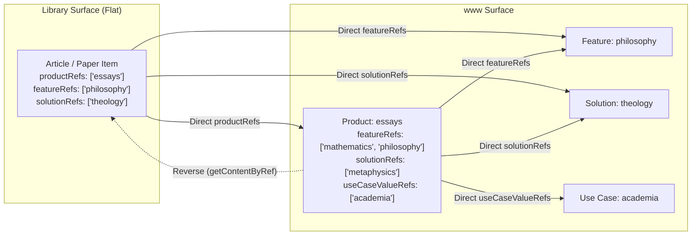

# Portable Single-Website Content Architecture Specification

> [!IMPORTANT]
> **CANONICAL ARCHITECTURE SPECIFICATION**: This document is the primary, authoritative target specification for building a single content-driven website architecture.
> 
> - **Authoritative Target Specification**: [`docs/architecture/markdown-content-website-architecture.md`](markdown-content-website-architecture.md) (This File)
> - **Repository Evidence & Traceability**: [`docs/architecture/current-repository-mapping.md`](current-repository-mapping.md)
> - **Archived Multi-Site Draft**: [`docs/architecture/portable-website-architecture.md`](portable-website-architecture.md) (Deprecated)

> [!NOTE]
> **Epistemic Discipline**: Every behavioural claim in this document carries a per-rule classification:
> - `[Extracted]` — Directly observed in repository source code. Evidence row exists in `current-repository-mapping.md`.
> - `[Normalised]` — Behaviour abstracted from repository implementation into a portable, framework-neutral rule.
> - `[Target Decision]` — A deliberate design choice for the portable architecture that differs from or extends the repository.

---

## 1. System Definition & Core Abstractions

### 1.1 Architectural Model `[Target Decision]`
The architecture defines a **Single Content-Driven Website Platform** that serves a primary marketing surface (`www`) alongside a content-oriented editorial sub-surface (`library`) from a unified content infrastructure.



> [!NOTE]
> **Scope Limitation**: The repository also contains `apps` and `documentation` surfaces. These are excluded from this specification. Future extensions may add contracts for those surfaces; they are not required to reproduce the core architecture. `[Target Decision]`

### 1.2 Core Architectural Abstractions

* **Website**: The single digital application property governed by a unified configuration, design system, and content model.
* **Surface**: A routing and presentation boundary within the website. Surfaces are resolved from HTTP hostname via middleware. Physical content folder determines surface. Surfaces are routing boundaries within one website, not separate tenants. `[Extracted]` `resolveSurface()` in `surface-utils.ts`.
* **Physical Family**: The route namespace and default entity type determined by a file's parent directory (e.g. `content/www/products/item.md` → physical family `product`, route `/products/item`). Physical family controls **routing**. `[Extracted]` `ENTITY_SECTIONS` constant.
* **Semantic Content Kind**: The classification determined by front-matter `contentKind` or inference from `inferKindFromSection()`. Semantic kind controls **metadata, schema selection, and presentation**. A file's semantic kind may differ from its physical family. `[Normalised]` from `inferContentMeta()`.
* **Content Item**: A single authored document represented by a Markdown file and YAML front-matter header. `[Extracted]` `ContentItem` interface in `types.ts`.
* **Content Collection**: A grouped set of content items residing in a single directory, configured by `_meta.json`. `[Extracted]` `getByPath()` returns `type: 'folder'` with `children`.
* **Page Model**: The resolved data structure produced after parsing Markdown, validating metadata, and indexing relationships. `[Normalised]`
* **Page Template**: The framework component that renders the Page Model into HTML. `[Extracted]`

### 1.3 Physical Family vs Semantic Content Kind `[Normalised]`

| Concern | Determined by | Controls | Can be overridden? |
| --- | --- | --- | --- |
| **Physical Family** | Parent directory path | Route namespace, URL structure, `ENTITY_SECTIONS` membership | No — moving a file changes its route and family |
| **Semantic Content Kind** | Front-matter `contentKind`, or `inferKindFromSection()` default | Schema selection, presentation variant, metadata inference | Yes — `contentKind` overrides folder inference |

A file at `content/www/products/item.md` with `contentKind: "article"`:
- **Route**: `/products/item` — determined by physical location, unchanged.
- **Schema/presentation**: Article — determined by `contentKind` override.

`[Extracted]` `inferContentMeta()` in `markdown.ts` line 488.

---

## 2. Single-Website Reproduction Scope & Module Architecture

### 2.1 Canonical Single-Website Directory Structure

> [!NOTE]
> This structure consolidates the repository's multi-site content roots into a single-website model. `[Target Decision]`
> **Repository evidence**: Each site stores content in `sites/<site>/content/www/` and `sites/<site>/content/library/`.

```text
website/
├── app/                               # Framework app directory (e.g. Next.js App Router)
├── content/                           # [Target Decision] Unified Content Root
│   ├── www/                           # Main Surface Content (www.example.com)
│   │   ├── pages/                     # [Target Decision] General Pages (about.md, privacy.md)
│   │   ├── products/                  # Product Entity Family
│   │   │   ├── _meta.json             # Collection config (title, layout, description)
│   │   │   └── *.md                   # Product entity files
│   │   ├── features/                  # Feature Entity Family
│   │   ├── solutions/                 # Solution Entity Family
│   │   └── use-cases/                 # Use Case Entity Family
│   └── library/                       # Editorial Surface Content (library.example.com)
│       └── *.md                       # FLAT: all articles & papers in one folder
├── content-engine/                    # Core Markdown, Schema & Query Utilities
│   ├── discovery.ts                   # File scanner & path parser
│   ├── schemas/                       # Front-matter Zod schemas
│   ├── markdown.ts                    # marked parser, KaTeX & prose pipeline
│   └── relationship-queries.ts        # Direct & reverse reference queries
├── templates/                         # Page Shell Components
│   ├── EntityPageTemplate.tsx         # Entity Layout with body region
│   ├── ArticleTemplate.tsx            # Long-form Article Layout
│   ├── PaperTemplate.tsx              # Journal Paper Layout with KaTeX & PDF
│   ├── EntityDirectoryTemplate.tsx    # Collection Grid Layout
│   └── GeneralPageTemplate.tsx        # Static page layout
├── routing/                           # Surface & Hostname Resolution
│   ├── surface-resolver.ts            # Hostname to Surface mapping
│   └── canonical-url.ts              # Surface-aware URL generator
└── public/                            # Static Assets
    ├── images/                        # Inline & hero images
    └── papers/                        # Downloadable PDF research papers
```

### 2.2 Core Module Responsibility Contracts

| Module Name | Primary Responsibility | Input Data | Output Artifact | Failure Behaviour | Classification |
| --- | --- | --- | --- | --- | --- |
| **Surface Registry** | Resolves target Surface from HTTP `Host` header | Hostname string | `SurfaceDefinition` object | Falls back to default `www` surface | `[Extracted]` `resolveSurface()` |
| **Physical-Family Resolver** | Maps parent directory to route namespace and entity type | File path | Family name (`product`, `feature`, etc.) | Unknown directories default to `article` kind | `[Extracted]` `ENTITY_SECTIONS`, `inferKindFromSection()` |
| **File Discovery** | Scans `content/` for `.md` files & `_meta.json` files | Surface content root path | Array of `ContentItem` objects | Skips entries starting with `_` or `.` | `[Extracted]` `getByPath()`, `getFolderContents()` |
| **Front-Matter Parsing** | Separates YAML front-matter from Markdown prose | Raw file string | `{ data: Record, content: string }` | Throws YAML syntax error | `[Extracted]` `gray-matter` |
| **Schema Validation** | Validates front-matter against Zod Schema | Raw front-matter object | Validated typed metadata | Zod throws `ZodError` | `[Target Decision]` Enforce at build time — see §3.3 |
| **Medium / Format Resolver** | Determines `Article` vs `Paper` presentation | Front-matter `medium`, `templateClass`, `contentType`, `format` + section | `MediumPresentation` object | Cascades: `medium` → aliases → section → default `'Page'` | `[Extracted]` `resolveMediumPresentation()` |
| **Metadata Normalisation** | Infers `contentKind`, `format`, `medium`, `date`, `isIndexable` | Raw metadata & slug path | `ContentMeta` object | Applies safe fallback defaults | `[Extracted]` `inferContentMeta()` |
| **Relationship Query** | Resolves direct slug references & reverse array-filter lookups | `productRefs`, `featureRefs`, etc. | Array of matching `ContentItem` objects | Returns empty array `[]` if no matches | `[Extracted]` `getContentByRef()` |
| **Markdown Processor** | Converts Markdown prose to HTML via `marked` & KaTeX | Raw Markdown string | HTML body string | `marked.parse()` throws on invalid Markdown | `[Extracted]` |
| **Heading Processor** | Injects `id` attributes on `<h1–3>` tags and builds TOC array | HTML body string | `{ html, toc }` | No duplicate-heading deduplication — identical text produces identical IDs | `[Extracted]` `processHeadings()` |
| **Page-Model Builder** | Assembles page data by merging front-matter, relationships, and body HTML | `ContentItem` + relationships | `EntityPageModel` / `EditorialPageModel` | Returns defaults for missing optional fields | `[Normalised]` |
| **Route Resolver** | Generates canonical URL path from surface & slug | Surface & relative file path | URL string (e.g. `/products/a`) | File-first resolution: `.md` file checked before folder. No collision detection | `[Extracted]` `getByPath()` lines 49–86 |
| **Template Selector** | Selects layout component based on physical family and `format` | Family + `MediumPresentation` | Component reference | Entity families → `EntityPageTemplate`; `format: 'paper'` → `PaperTemplate`; `format: 'article'` → `ArticleTemplate`; else → `GeneralPageTemplate` | `[Target Decision]` |
| **Directory Generator** | Builds index grid data for collection routes | Folder `ContentItem` with `children` | Sorted children array | `EntityDirectoryTemplate` for entity sections | `[Extracted]` |
| **SEO Metadata Builder** | Generates `<title>`, meta description, OpenGraph | Page data + Surface Config | Framework `Metadata` object | Uses surface default title & description | `[Extracted]` `generateMetadata()` |
| **OG Image Generator** | Generates dynamic Open Graph card images | Title, subtitle, type params | Image response at `/api/og` | Falls back to static default OG image | `[Extracted]` `buildOgUrl()` |
| **Sitemap Generator** | Builds sitemap entries filtering non-indexable items | All content directories | `SitemapItem[]` array | Excludes items where `isIndexable === false` or `noindex === true` | `[Extracted]` `getDynamicSitemapEntries()` |
| **Asset Resolver** | Resolves PDF download URLs | Slug string | Asset URL or `null` | Returns `null` if `public/papers/[slug].pdf` absent | `[Extracted]` `getPdfUrl()` |

---

## 3. Schema Architecture & Content Tree

### 3.1 Content Root Mapping

| Repository Content Root | Portable Name | Classification |
| --- | --- | --- |
| `sites/<site>/content/www/` | `content/www/` | `[Extracted]` name preserved |
| `sites/<site>/content/library/` | `content/library/` | `[Extracted]` name preserved |

### 3.2 Repository Schema Evidence

| Repository Schema | Repository File | Portable Family | Required Fields | Optional Fields | Classification |
| --- | --- | --- | --- | --- | --- |
| `ServiceSchema` | `schemas/service.schema.ts` | Product | `title`, `description` | `features[]`, `icon?`, `featured`, `order` | `[Extracted]` |
| `ProjectSchema` | `schemas/project.schema.ts` | Feature / Project | `description` | `id?`, `name?`, `title?`, `tagline?`, `category?`, `status?`, `date?`, `year?`, `tags[]`, `image?`, `url?`, `link?`, `featured` | `[Extracted]` |
| `PostSchema` | `schemas/post.schema.ts` | Editorial Item | `title`, `excerpt`, `date` | `author?`, `tags[]`, `category?`, `readTime?`, `coverImage?` | `[Extracted]` |
| `PageSchema` | `schemas/page.schema.ts` | General Page | `title`, `description`, `template` | `slug?`, `seo?`, `sections?`, `publishedAt?`, `updatedAt?` | `[Extracted]` |
| `CaseStudySchema` | `schemas/case-study.schema.ts` | Case Study | `client`, `title`, `summary`, `outcome`, `services[]`, `date` | — | `[Extracted]` |

### 3.3 Target Schema Model `[Target Decision]`

The repository has separate schemas per family but they are not enforced at build time. The four ontology entity families (Product, Feature, Solution, Use Case) share a single data interface and template in the current implementation.

The portable architecture adopts a **shared base entity schema with family-specific relationship constraints**:

```typescript
// [Target Decision] Shared base for all ontology entities
const BaseEntitySchema = z.object({
  title: z.string(),
  description: z.string(),
  category: z.string().optional(),
  icon: z.string().optional(),
  order: z.number().default(99),
  excerpt: z.string().optional(),
  tags: z.array(z.string()).default([]),
  // Rich presentation fields
  heroFeatures: z.array(z.object({ title: z.string(), description: z.string() })).optional(),
  deepWorkFeatures: z.array(z.object({ icon: z.string(), title: z.string(), description: z.string() })).optional(),
  pullQuote: z.string().optional(),
  pullQuoteAttribution: z.string().optional(),
});

// [Target Decision] Family-specific relationship constraints
const ProductEntitySchema = BaseEntitySchema.extend({
  featureRefs: z.array(z.string()).default([]),
  solutionRefs: z.array(z.string()).default([]),
  useCaseValueRefs: z.array(z.string()).default([]),
});

const FeatureEntitySchema = BaseEntitySchema.extend({
  productRefs: z.array(z.string()).default([]),
  solutionRefs: z.array(z.string()).default([]),
  useCaseValueRefs: z.array(z.string()).default([]),
});

const SolutionEntitySchema = BaseEntitySchema.extend({
  productRefs: z.array(z.string()).default([]),
  featureRefs: z.array(z.string()).default([]),
});

const UseCaseEntitySchema = BaseEntitySchema.extend({
  productRefs: z.array(z.string()).default([]),
  featureRefs: z.array(z.string()).default([]),
  solutionRefs: z.array(z.string()).default([]),
});
```

**Validation enforcement**: `[Target Decision]` Schema validation MUST be enforced during content loading. Invalid files MUST produce a build error with a diagnostic message naming the file and failed constraint. This differs from the extracted implementation, where `getByPath()` parses all `.md` files without schema validation.

### 3.4 Content Tree Structure

```text
content/
├── www/                               # Main Surface Root [Extracted name]
│   ├── pages/                         # [Target Decision] General static pages
│   │   └── *.md                       # about.md, privacy.md, terms.md
│   ├── products/                      # [Extracted] Entity Family
│   │   ├── _meta.json                 # [Extracted] Collection config
│   │   └── *.md                       # Product entity files
│   ├── features/                      # [Extracted] Entity Family
│   ├── solutions/                     # [Extracted] Entity Family
│   └── use-cases/                     # [Extracted] Entity Family
└── library/                           # Editorial Surface Root [Extracted name]
    └── *.md                           # [Extracted] FLAT — no sub-folders
```

* **Directory Level 1 (`content/www/`, `content/library/`)**: Defines the target **Surface** routing boundary. `[Extracted]`
* **Directory Level 2 (`products/`, `features/`)**: Defines the **Physical Family** for entity items on the `www` surface. `[Extracted]`
* **Library**: Contains ALL editorial content in a single flat folder. Article vs. Paper distinction is determined by front-matter `medium` field, NOT by folder structure. `[Extracted]`

### 3.5 General Page Folder `[Target Decision]`

General pages live in `content/www/pages/`. The route resolver strips the `pages/` segment so that `content/www/pages/about.md` routes to `/about`.

> [!IMPORTANT]
> **Repository evidence**: The extracted implementation does not have a dedicated `content/www/pages/` folder. General pages are rendered by the catch-all route for any `www` file that is not inside an entity sub-folder. The `pages/` convention is a `[Target Decision]` for cleaner content organisation.

### 3.6 Entity Section Constant `[Extracted]`

```typescript
const ENTITY_SECTIONS = ['products', 'features', 'solutions', 'use-cases'];
```
Evidence: `markdown.ts` line 437 and `page.tsx` line 212.

---

## 4. Complete Content-Family Contracts

> [!IMPORTANT]
> **Target Decision: Ontology pages render their Markdown body.**
>
> The extracted entity template (`EntityPageTemplate`) is composed entirely from structured front-matter fields: hero, social links, featured sections, relationship grids, pull quotes, and a subscribe CTA. There is no Markdown body region.
>
> The portable architecture requires that all ontology pages render the parsed Markdown body as the **primary long-form content region**. The body appears after structured metadata regions and before relationship regions.
>
> ```text
> Extracted entity composition (no body):     Target entity composition (with body):
> Hero                                        Hero
> → Social links                              → Rich metadata regions (optional)
> → Featured section                          → Rendered Markdown body (required)
> → Related-item grid                         → Direct relationship regions
> → Pull quote                                → Reverse-related editorial content
> → Deep-work section                         → CTA
> → Subscribe CTA
> ```
>
> This is the most significant divergence between the extracted and target architectures.

### 4.1 Product Entity Family

1. **Semantic Purpose**: Content categories, platforms, or offerings. `[Normalised]`
2. **Canonical Folder**: `content/www/products/` `[Extracted]`
3. **Allowed File Forms**: `[slug].md` `[Extracted]`
4. **Directory Indexes Supported**: Yes — `products/_meta.json`. `[Extracted]` Real file: `{"type":"collection","title":"Content Types","layout":"grid"}`.
5. **Surface**: `www` surface. `[Extracted]`
6. **Route Pattern**: `/products/[slug]` `[Extracted]`
7. **Slug Derivation**: Filename without `.md` extension. Front-matter does not override slug. `[Extracted]` `getByPath()` line 56.
8. **Schema**: `ProductEntitySchema` extending `BaseEntitySchema`. `[Target Decision]`
9. **Required Front Matter**: `title`, `description`. `[Extracted]` from `ServiceSchema`.
10. **Optional Front Matter**: `category`, `icon`, `order`, `excerpt`, `tags`, `featureRefs`, `solutionRefs`, `useCaseValueRefs`, `heroFeatures[]`, `deepWorkFeatures[]`, `pullQuote`, `pullQuoteAttribution`. `[Extracted]` from `EntityPageData` interface.
11. **Allowed Direct Relationships**: `featureRefs`, `solutionRefs`, `useCaseValueRefs`. `[Extracted]` page.tsx lines 612–617.
12. **Derived Reverse Relationships**: Receives reverse lookup from Editorial items tagged with `productRefs`. `[Extracted]` `getContentByRef('productRefs', slug)`.
13. **Markdown Body Role**: `[Target Decision]` Primary long-form content region. Rendered as styled prose HTML between structured metadata and relationship sections.
14. **Page-Model Shape**: `EntityPageModel` — see §8. `[Normalised]`
15. **Page Composition Order**: Hero → Rich metadata regions (optional) → **Markdown body** → Related entities grid → Reverse-related editorial content → CTA. `[Target Decision]`
16. **Index-Card Representation**: Card in `/products` grid via `EntityDirectoryTemplate` with `title`, `description`, `href`, `icon`. `[Extracted]` page.tsx lines 491–503.
17. **SEO Behaviour**: Title: `Title | Products`. Meta Description: `description`. OG Image: `buildOgUrl()`. `[Extracted]` `generateMetadata()`.
18. **Empty-State Behaviour**: `[Target Decision]` Regions are **omitted** when their data is absent. No hardcoded fallback content is rendered. This differs from the extracted implementation, which fills missing fields with site-specific default prose.
19. **Validation Behaviour**: `[Target Decision]` Build fails if `title` or `description` is missing. Schema enforced at content-load time.

### 4.2 Feature Entity Family

1. **Semantic Purpose**: Modular capabilities, knowledge domains, or discipline areas. `[Normalised]`
2. **Canonical Folder**: `content/www/features/` `[Extracted]`
3. **Allowed File Forms**: `[slug].md` `[Extracted]`
4. **Directory Indexes Supported**: Yes — via `_meta.json`. `[Extracted]`
5. **Surface**: `www` surface. `[Extracted]`
6. **Route Pattern**: `/features/[slug]` `[Extracted]`
7. **Slug Derivation**: Filename without `.md`. `[Extracted]`
8. **Schema**: `FeatureEntitySchema` extending `BaseEntitySchema`. `[Target Decision]`
9. **Required Front Matter**: `title`, `description`. `[Normalised]`
10. **Optional Front Matter**: Same shared set as Product. `[Extracted]` All four entity families share the same data interface.
11. **Allowed Direct Relationships**: `productRefs`, `solutionRefs`, `useCaseValueRefs`. `[Extracted]`
12. **Derived Reverse Relationships**: Receives reverse lookup from Editorial items tagged with `featureRefs`. `[Extracted]`
13. **Markdown Body Role**: `[Target Decision]` Primary long-form content region — same as Product.
14. **Page-Model Shape**: `EntityPageModel` — same as Product. `[Extracted]` All four entity types share the same template.
15. **Page Composition Order**: Same as Product. `[Target Decision]`
16. **Index-Card Representation**: Card in `/features` grid. `[Extracted]`
17. **SEO Behaviour**: Title: `Title | Features`. `[Extracted]`
18. **Empty-State Behaviour**: Omit regions when absent. `[Target Decision]`
19. **Validation Behaviour**: Same as Product. `[Target Decision]`

### 4.3 Solution Entity Family

1. **Semantic Purpose**: Industry topics, problem domains, or discipline solutions. `[Normalised]`
2. **Canonical Folder**: `content/www/solutions/` `[Extracted]`
3. **Allowed File Forms**: `[slug].md` `[Extracted]`
4. **Directory Indexes Supported**: Yes — via `_meta.json`. `[Extracted]`
5. **Surface**: `www` surface. `[Extracted]`
6. **Route Pattern**: `/solutions/[slug]` `[Extracted]`
7. **Slug Derivation**: Filename without `.md`. `[Extracted]`
8. **Schema**: `SolutionEntitySchema` extending `BaseEntitySchema`. `[Target Decision]`
9. **Required Front Matter**: `title`, `description`. `[Normalised]`
10. **Optional Front Matter**: Same shared set as Product. `[Extracted]`
11. **Allowed Direct Relationships**: `productRefs`, `featureRefs`. `[Extracted]`
12. **Derived Reverse Relationships**: Receives reverse lookup from Editorial items tagged with `solutionRefs`. `[Extracted]`
13. **Markdown Body Role**: `[Target Decision]` Primary long-form content region.
14. **Page-Model Shape**: `EntityPageModel`. `[Normalised]`
15. **Page Composition Order**: Same as Product. `[Target Decision]`
16. **Index-Card Representation**: Card in `/solutions` grid. `[Extracted]`
17. **SEO Behaviour**: Title: `Title | Solutions`. `[Extracted]`
18. **Empty-State Behaviour**: Omit regions when absent. `[Target Decision]`
19. **Validation Behaviour**: Same as Product. `[Target Decision]`

### 4.4 Use Case Entity Family

1. **Semantic Purpose**: Targeted audience, role, or outcome applications. `[Normalised]`
2. **Canonical Folder**: `content/www/use-cases/` `[Extracted]`
3. **Allowed File Forms**: `[slug].md` `[Extracted]`
4. **Directory Indexes Supported**: Yes — via `_meta.json`. `[Extracted]`
5. **Surface**: `www` surface. `[Extracted]`
6. **Route Pattern**: `/use-cases/[slug]` `[Extracted]`
7. **Slug Derivation**: Filename without `.md`. `[Extracted]`
8. **Schema**: `UseCaseEntitySchema` extending `BaseEntitySchema`. `[Target Decision]`
9. **Required Front Matter**: `title`, `description`. `[Normalised]`
10. **Optional Front Matter**: Same shared set as Product. `[Extracted]`
11. **Allowed Direct Relationships**: `productRefs`, `featureRefs`, `solutionRefs`. `[Extracted]`
12. **Derived Reverse Relationships**: Discovered by Products declaring `useCaseValueRefs`. `[Extracted]` `ENTITY_REF_MAP['use-cases'] = 'useCaseValueRefs'` in page.tsx line 202.
13. **Markdown Body Role**: `[Target Decision]` Primary long-form content region.
14. **Page-Model Shape**: `EntityPageModel`. `[Normalised]`
15. **Page Composition Order**: Same as Product. `[Target Decision]`
16. **Index-Card Representation**: Card in `/use-cases` grid. `[Extracted]`
17. **SEO Behaviour**: Title: `Title | Use Cases`. `[Extracted]`
18. **Empty-State Behaviour**: Omit regions when absent. `[Target Decision]`
19. **Validation Behaviour**: Same as Product. `[Target Decision]`

### 4.5 General Page

1. **Semantic Purpose**: Static information pages (About, Privacy, Terms). `[Normalised]`
2. **Canonical Folder**: `content/www/pages/` `[Target Decision]` — see §3.5.
3. **Allowed File Forms**: `[slug].md` `[Extracted]`
4. **Directory Indexes Supported**: No. `[Target Decision]`
5. **Surface**: `www` surface. `[Extracted]`
6. **Route Pattern**: `/[slug]` — the `pages/` segment is stripped from the URL. `[Target Decision]`
7. **Slug Derivation**: Filename without `.md`. `[Extracted]`
8. **Schema**: `PageSchema` (`title`, `description`). `[Extracted]` `page.schema.ts`.
9. **Required Front Matter**: `title`. `[Extracted]` from `PageSchema`.
10. **Optional Front Matter**: `description`, `excerpt`, `category`, `isIndexable`. `[Normalised]`
11. **Allowed Direct Relationships**: None. `[Extracted]`
12. **Derived Reverse Relationships**: None. `[Extracted]`
13. **Markdown Body Role**: Complete page prose content. `[Extracted]`
14. **Page-Model Shape**: `GeneralPageModel` — title, description, bodyHtml. `[Normalised]`
15. **Page Composition Order**: Category badge (if present) → `<h1>` title → Excerpt (if present) → Markdown body. `[Extracted]` page.tsx lines 674–695.
16. **Index-Card Representation**: Not rendered in card grids. `[Extracted]`
17. **SEO Behaviour**: Title: `title`. `[Extracted]`
18. **Empty-State Behaviour**: N/A. `[Extracted]`
19. **Validation Behaviour**: `[Target Decision]` Build fails if `title` is missing.

### 4.6 Editorial Item (Article Presentation)

1. **Semantic Purpose**: Long-form essays, blog posts, articles. `[Normalised]`
2. **Canonical Folder**: `content/library/` (flat — no `articles/` subfolder). `[Extracted]` `CONTENT_FOLDERS = ['library']`.
3. **Allowed File Forms**: `[slug].md` `[Extracted]`
4. **Directory Indexes Supported**: Not applicable — flat folder. `[Extracted]`
5. **Surface**: `library` surface (e.g. `library.example.com`). `[Extracted]`
6. **Route Pattern**: `/[slug]` — flat slug on subdomain. `[Extracted]`
7. **Slug Derivation**: Filename without `.md`. `[Extracted]`
8. **Schema**: `EditorialSchema` (portable name for `PostSchema`). `[Normalised]`
9. **Required Front Matter**: `title`, `date`. `[Extracted]` from `PostSchema`. Runtime handles missing `date` gracefully; sitemap falls back to file mtime.
10. **Optional Front Matter**: `description`, `excerpt`, `author`, `category`, `tags`, `medium`, `productRefs`, `featureRefs`, `solutionRefs`, `useCaseValueRefs`, `useCaseFieldRefs`. `[Extracted]`
11. **Presentation Determination**: `medium: "Article"` (explicit or default). `resolveMediumPresentation()` cascades: `medium` → alias keys → section name → default. `[Extracted]`
12. **Allowed Direct Relationships**: `productRefs`, `featureRefs`, `solutionRefs`, `useCaseValueRefs`, `useCaseFieldRefs`. `[Extracted]`
13. **Derived Reverse Relationships**: Discovered by entity pages via `getContentByRef()`. `[Extracted]`
14. **Markdown Body Role**: Primary article text with GFM formatting, code blocks, blockquotes. `[Extracted]`
15. **Page-Model Shape**: `EditorialPageModel` — see §8. `[Normalised]`
16. **Page Composition Order**: Subdomain layout wrapper (sidebar + TOC) → ArticleTemplate (title, date, category, excerpt, html, readingTime). `[Extracted]` page.tsx lines 371–399.
17. **Index-Card Representation**: Rendered in library surface index. `[Extracted]`
18. **SEO Behaviour**: Title: `Title | Library`. Meta Description: `description || excerpt`. OG Image: `buildOgUrl()`. `[Extracted]`
19. **Empty-State Behaviour**: TOC omitted if empty. `[Extracted]`
20. **Validation Behaviour**: `[Target Decision]` Build fails if `title` or `date` is missing/invalid.

### 4.7 Editorial Item (Paper Presentation)

1. **Semantic Purpose**: Scholarly research papers, formal proofs, technical monographs. `[Normalised]`
2. **Canonical Folder**: Same as Article — `content/library/` (flat). `[Extracted]` Determined by `medium` front-matter, NOT folder.
3. **Allowed File Forms**: `[slug].md` `[Extracted]`
4. **Directory Indexes Supported**: Not applicable. `[Extracted]`
5. **Surface**: `library` surface. `[Extracted]`
6. **Route Pattern**: `/[slug]` — same flat slug as Article. `[Extracted]`
7. **Slug Derivation**: Filename without `.md`. `[Extracted]`
8. **Schema**: Same `EditorialSchema`. No separate `PaperSchema` exists. `[Extracted]`
9. **Required Front Matter**: `title`, `date`, `medium: "Paper"`. `[Extracted]` `medium: "Paper"` is the discriminator selecting `PaperTemplate`.
10. **Optional Front Matter**: Same as Article, plus `subtitle`, `cover_image`. `[Extracted]`
11. **Presentation Determination**: `medium: "Paper"` or `templateClass: "paper"` triggers `format: 'paper'`. `[Extracted]`
12. **Markdown Body Role**: Includes LaTeX mathematical notation ($...$, $$...$$), Abstract section, formal theorems. `[Extracted]`
13. **Page Composition Order**: Subdomain layout wrapper (sidebar + TOC + pubDetails) → PaperTemplate (title, subtitle, author, date, category, excerpt, coverImage, pdfUrl, html). `[Extracted]`
14. **PDF Resolution**: `getPdfUrl(slug)` checks `public/papers/[slug].pdf`. If found → URL. If not → `null` → button omitted. `[Extracted]`
15. **SEO Behaviour**: Same as Article. `[Extracted]`
16. **Empty-State Behaviour**: PDF CTA hidden if `getPdfUrl()` returns `null`. `[Extracted]`
17. **Validation Behaviour**: Same as Article. `[Target Decision]`

---

## 5. Front-Matter Field Matrices

### 5.1 Entity Field Matrix (All Four Ontology Families)

> [!NOTE]
> All four entity families share the same data interface and template. `[Extracted]` The field matrix below applies to Products, Features, Solutions, and Use Cases.

| Field | Type | Required | Default | Consumer | Empty Behaviour | Classification |
| --- | --- | --- | --- | --- | --- | --- |
| `title` | `string` | **Yes** | — | Hero `<h1>`, SEO | Build error | `[Extracted]` |
| `description` | `string` | **Yes** | — | Hero subtitle, meta description | Build error | `[Extracted]` |
| `category` | `string` | Optional | Omitted | Hero badge | Badge omitted | `[Target Decision]` |
| `icon` | `string` | Optional | Omitted | Directory card, hero | Icon omitted | `[Target Decision]` |
| `order` | `number` | Optional | `99` | Directory sorting | Default sort position | `[Extracted]` |
| `excerpt` | `string` | Optional | — | Directory card description | Card shows `description` | `[Extracted]` |
| `tags` | `string[]` | Optional | `[]` | Topic badges | Badges omitted | `[Extracted]` |
| `featureRefs` | `string[]` | Optional | `[]` | Related entities grid | Region omitted | `[Extracted]` |
| `solutionRefs` | `string[]` | Optional | `[]` | Related entities grid | Region omitted | `[Extracted]` |
| `productRefs` | `string[]` | Optional | `[]` | Related entities grid | Region omitted | `[Extracted]` |
| `useCaseValueRefs` | `string[]` | Optional | `[]` | Related entities grid | Region omitted | `[Extracted]` |
| `heroFeatures` | `{title, description}[]` | Optional | Omitted | Hero feature highlights | Region omitted | `[Target Decision]` |
| `deepWorkFeatures` | `{icon, title, description}[]` | Optional | Omitted | Deep-work highlight section | Region omitted | `[Target Decision]` |
| `pullQuote` | `string` | Optional | Omitted | Blockquote section | Region omitted | `[Target Decision]` |
| `pullQuoteAttribution` | `string` | Optional | Omitted | Attribution below quote | Omitted | `[Target Decision]` |

> [!WARNING]
> **Extracted implementation note**: The current `EntityPageTemplate` fills missing `heroFeatures`, `deepWorkFeatures`, `pullQuote`, and `rhsCards` with hardcoded site-specific content (theology-themed defaults). The portable architecture does NOT reproduce this behaviour. Absent optional fields result in omitted regions, not fallback content. `[Target Decision]`

### 5.2 Editorial (Article & Paper) Field Matrix

| Field | Type | Required | Default | Consumer | Empty Behaviour | Classification |
| --- | --- | --- | --- | --- | --- | --- |
| `title` | `string` | **Yes** | — | Article/Paper header, SEO | Build error | `[Extracted]` |
| `date` | `string` | **Yes** (schema) | File mtime (sitemap) | Publication date, sort order | Sitemap uses file mtime | `[Extracted]` |
| `medium` | `string` | Optional | `"Article"` | Template selection | Defaults to `ArticleTemplate` | `[Extracted]` |
| `excerpt` | `string` | Optional | — | Card description, meta | Uses `description` | `[Extracted]` |
| `description` | `string` | Optional | — | Meta description | Omitted | `[Extracted]` |
| `author` | `string` | Optional | Site default | Header byline | Site default author | `[Normalised]` |
| `category` | `string` | Optional | — | Category badge, tags fallback | Omitted | `[Extracted]` |
| `tags` | `string[]` | Optional | Derived from `category` | Tag badges | Omitted | `[Extracted]` |
| `subtitle` | `string` | Optional | — | Paper header | Omitted (Paper only) | `[Extracted]` |
| `cover_image` | `string` | Optional | — | Paper cover | Omitted (Paper only) | `[Extracted]` |
| `productRefs` | `string[]` | Optional | `[]` | Cross-surface entity link | Omitted | `[Extracted]` |
| `featureRefs` | `string[]` | Optional | `[]` | Cross-surface entity link | Omitted | `[Extracted]` |
| `solutionRefs` | `string[]` | Optional | `[]` | Cross-surface entity link | Omitted | `[Extracted]` |
| `useCaseValueRefs` | `string[]` | Optional | `[]` | Cross-surface entity link | Omitted | `[Extracted]` |
| `useCaseFieldRefs` | `string[]` | Optional | `[]` | Category domain link (separate from useCaseValueRefs) | Omitted | `[Extracted]` |
| `isIndexable` | `boolean` | Optional | `true` | Sitemap inclusion | Included in sitemap | `[Extracted]` |

### 5.3 `useCaseValueRefs` vs `useCaseFieldRefs` — Separate Semantics `[Extracted]`

| Field | Semantic Purpose | Resolution | Legacy Alias | Evidence |
| --- | --- | --- | --- | --- |
| `useCaseValueRefs` | Outcome/audience slugs (e.g. `['academia']`) | `resolveUseCaseValueRefs()` — takes last segment after `/` | `forUseCases` | `markdown.ts` L355–366 |
| `useCaseFieldRefs` | Category/domain slugs | `resolveUseCaseFieldRefs()` — takes first segment before `/` | None | `markdown.ts` L368–371 |

---

## 6. Folder & Front-Matter Precedence Rules

### 6.1 Precedence Matrix

| Concern | Primary Source | Permitted Override | Conflict Resolution | Classification |
| --- | --- | --- | --- | --- |
| **Surface Boundary** | Physical folder (`content/www/` vs `content/library/`) | None | Folder determines surface. No front-matter field can change this | `[Extracted]` |
| **Physical Family** (routing) | Parent directory name (`products/`, `features/`, etc.) | None | Directory determines route namespace. Moving a file changes its route | `[Extracted]` |
| **Semantic Content Kind** (metadata) | `inferKindFromSection()` default from parent directory | Front-matter `contentKind` | `contentKind` overrides inferred kind for schema selection and presentation | `[Extracted]` `inferContentMeta()` line 488 |
| **Presentation Variant** | Front-matter `medium` / `templateClass` | Section name as fallback | `medium` > alias keys > section name > default | `[Extracted]` `resolveMediumPresentation()` cascade |
| **Item Slug** | Filename without `.md` | None | No front-matter override mechanism exists | `[Extracted]` `getByPath()` line 56 |

### 6.2 Precedence Question Resolution Table

| Scenario | Deterministic Rule | Classification |
| --- | --- | --- |
| Can front matter change a file's surface? | No. Physical directory establishes surface routing | `[Extracted]` |
| Can `contentKind` change a file's route? | No. Route is determined by physical path. `contentKind` affects only metadata/presentation | `[Normalised]` |
| Can `contentKind` change schema validation? | Yes. `contentKind` overrides folder-inferred kind for schema selection | `[Extracted]` |
| Does moving a file change its route? | Yes. Path relative to surface root establishes URL route | `[Extracted]` |
| Can an editorial item reference a www-surface entity? | Yes. `productRefs`, `featureRefs`, `solutionRefs` allow cross-surface references | `[Extracted]` |
| Can the same file appear on multiple surfaces? | No. Each file resides under one surface directory | `[Extracted]` |
| How are unknown folders handled? | `inferKindFromSection()` defaults to `'article'` kind | `[Extracted]` |
| How are file vs directory collisions handled? | `getByPath()` checks `.md` file first, then directory. First match wins. No error thrown | `[Extracted]` |

---

## 7. Complete Relationship Model



### 7.1 Relationship Field Specification `[Extracted]`

| Field Name | Declaring Families | Direct Resolver | Reverse Resolver | Library Surface Label | Classification |
| --- | --- | --- | --- | --- | --- |
| `productRefs` | Editorial, Feature, Solution | `getByPath(['www', 'products', slug])` | `getContentByRef('productRefs', slug, ['library'])` | `'Content Types'` | `[Extracted]` |
| `featureRefs` | Editorial, Product, Solution | `getByPath(['www', 'features', slug])` | `getContentByRef('featureRefs', slug, ['library'])` | `'Domains'` | `[Extracted]` |
| `solutionRefs` | Editorial, Product, Feature | `getByPath(['www', 'solutions', slug])` | `getContentByRef('solutionRefs', slug, ['library'])` | `'Topics'` | `[Extracted]` |
| `useCaseValueRefs` | Product, Editorial | `resolveUseCaseValueRefs()` | `getContentByRef('useCaseValueRefs', slug, ['library'])` | `'Audiences'` | `[Extracted]` |
| `useCaseFieldRefs` | Editorial | `resolveUseCaseFieldRefs()` | `getContentByRef('useCaseFieldRefs', slug, ['library'])` | — | `[Extracted]` |

### 7.2 Library Surface Entity-Filtered Views `[Extracted]`

On the library surface, entity sections serve as filtered content directories:

```text
library.example.com/products/essays → Library items with productRefs including 'essays'
library.example.com/features/philosophy → Library items with featureRefs including 'philosophy'
```

Mapping constant:
```typescript
const ENTITY_REF_MAP = {
  'products': 'productRefs',
  'features': 'featureRefs',
  'solutions': 'solutionRefs',
  'use-cases': 'useCaseValueRefs',
};
```
Evidence: page.tsx lines 198–203.

---

## 8. Page-Model Specification

### 8.1 Portable Page Model Definitions `[Normalised]`

```typescript
// Portable entity page model — [Target Decision] includes bodyHtml
interface EntityPageModel {
  slug: string;
  section: 'products' | 'features' | 'solutions' | 'use-cases';
  // Hero region
  title: string;
  description: string;
  category?: string;
  icon?: string;
  // Optional rich metadata regions — omitted when absent
  heroFeatures?: { title: string; description: string }[];
  deepWorkFeatures?: { icon: string; title: string; description: string }[];
  pullQuote?: string;
  pullQuoteAttribution?: string;
  // [Target Decision] Mandatory body region
  bodyHtml: string;
  tableOfContents: { id: string; text: string; level: number }[];
  // Relationship regions
  relatedItems: { title: string; description: string; href: string; icon?: string }[];
  reverseEditorialItems: { title: string; date: string; excerpt: string; href: string }[];
}

// Portable editorial page model
interface EditorialPageModel {
  slug: string;
  format: 'article' | 'paper';
  title: string;
  date?: string;
  author: string;
  category?: string;
  tags: string[];
  excerpt?: string;
  subtitle?: string;       // Paper only
  coverImage?: string;     // Paper only
  bodyHtml: string;
  tableOfContents: { id: string; text: string; level: number }[];
  readingTimeMinutes: number;
  pdfUrl: string | null;   // Paper only
}

// Portable general page model
interface GeneralPageModel {
  slug: string;
  title: string;
  description?: string;
  excerpt?: string;
  category?: string;
  bodyHtml: string;
}
```

### 8.2 Reference Implementation Profile

> [!NOTE]
> The following table maps portable model concepts to project-specific repository symbols. These names are implementation evidence, not part of the portable specification.

| Portable Concept | Repository Symbol | Repository Path | Classification |
| --- | --- | --- | --- |
| `EntityPageModel` | `TimothyEntityPageData` | `rich-page-data.ts` | `[Extracted]` |
| Entity field list | `TIMOTHY_RICH_FIELDS` | `page.tsx` L214–229 | `[Extracted]` |
| Field alias map | `TIMOTHY_ALIASES` | `page.tsx` L231–236 | `[Extracted]` |
| Entity template | `EntityPageTemplate` | `components/entity-page/EntityPageTemplate.tsx` | `[Extracted]` |
| Article template | `ArticleTemplate` | `packages/ui/.../LibraryTemplates.tsx` | `[Extracted]` |
| Paper template | `PaperTemplate` | `packages/ui/.../LibraryTemplates.tsx` | `[Extracted]` |
| Page-model builder | `resolveRichPageData()` | `rich-page-data.ts` | `[Extracted]` |
| General page rendering | Inline in `page.tsx` L666–697 | `page.tsx` | `[Extracted]` |

---

## 9. Page Composition Region Ordering

### 9.1 Region Ordering Matrix

| Content Family | Region 1 | Region 2 | Region 3 | Region 4 | Region 5 | Region 6 | Classification |
| --- | --- | --- | --- | --- | --- | --- | --- |
| **All Entities** | Hero (Title + Badge) | Rich metadata (optional) | **Markdown body** | Related entities grid | Reverse editorial content | CTA | `[Target Decision]` |
| **General Page** | Category badge + `<h1>` | Excerpt | Markdown body | — | — | — | `[Extracted]` L674–695 |
| **Article** | Article header (title, date, author, readingTime) | TOC sidebar | Markdown body | — | — | — | `[Extracted]` L371–399 |
| **Paper** | Paper header (title, subtitle, author, date, PDF CTA) | TOC sidebar | KaTeX Markdown body | — | — | — | `[Extracted]` L318–356 |
| **Entity Directory** | Header (title, description) | Item cards grid | — | — | — | — | `[Extracted]` L491–503 |

> [!IMPORTANT]
> **Extracted entity template has no body region.** The current `EntityPageTemplate` renders 7 structured front-matter regions (Hero → Socials → Featured → Curriculum → Quote → DeepWork → Subscribe) without a Markdown prose region. The target architecture adds a body region at position 3. This is the primary divergence between the extracted and target architectures. `[Target Decision]`

### 9.2 Collection Layout Variants `[Extracted]`

Folder `_meta.json` specifies `layout` to select collection rendering:

| `layout` value | Rendering | Evidence |
| --- | --- | --- |
| `grid` | `FeatureGrid` component — card grid with icons | page.tsx L546–557 |
| `list` | Article-style list with date, category, excerpt | page.tsx L567–594 |
| `hero` | Full-width hero cards per child item | page.tsx L515–530 |
| `network` | `NetworkGrid` component | page.tsx L560–564 |

---

## 10. Markdown Processing Pipeline

### 10.1 Pipeline Stages `[Extracted]`

```text
1. Front-Matter Extraction:
   Raw file → gray-matter → { data: Record, content: string }
   [Extracted] markdown.ts line 130

2. Markdown → HTML:
   content string → marked.parse(content) → HTML string
   [Extracted] marked config: { gfm: true, breaks: true }
   KaTeX: { throwOnError: false, nonStandard: true }
   
3. Heading Processing (site-level):
   HTML → processHeadings() → { html: processedHtml, toc: TocItem[] }
   [Extracted] page.tsx L29–47
   Regex: /<h([1-3])([^>]*)>([\s\S]*?)<\/h\d>/gi
   ID: text.toLowerCase().replace(/[^a-z0-9]+/g, '-').replace(/(^-|-$)/g, '')
   WARNING: No duplicate heading deduplication

4. Reading Time:
   HTML → estimateReadTime() → number (minutes)
   [Extracted] Strip tags → count words → /200 → ceil → max(1)
```

### 10.2 Markdown Processor Details

| Feature | Behaviour | Classification |
| --- | --- | --- |
| Front-matter fences | `---` delimiters via `gray-matter` | `[Extracted]` |
| GFM support | `gfm: true` | `[Extracted]` |
| Line breaks | `breaks: true` | `[Extracted]` |
| Math notation | `$...$` inline, `$$...$$` display via `marked-katex-extension` | `[Extracted]` |
| KaTeX error handling | `throwOnError: false` — renders error text, not exception | `[Extracted]` |
| Raw HTML policy | Passed through without stripping, rendered via `dangerouslySetInnerHTML` | `[Extracted]` |
| Sanitisation | **None** — no DOMPurify or equivalent | `[Extracted]` |
| Heading IDs | Regex slugification of text content | `[Extracted]` |
| Duplicate heading IDs | **Not handled** — identical text produces identical IDs | `[Extracted]` |
| TOC generation | Array of `{ id, text, level }` from all h1–h3 tags; always built | `[Extracted]` |
| Reading time | Word count / 200, minimum 1 minute | `[Extracted]` |

---

## 11. Asset Resolution Pipeline

| Asset Type | Resolution Rule | Missing Behaviour | Classification |
| --- | --- | --- | --- |
| **PDF Paper** | `getPdfUrl(slug)`: `public/papers/[slug].pdf` → `/papers/[slug].pdf` or `null` | Download button omitted | `[Extracted]` |
| **OG Image** | `buildOgUrl(title, subtitle, type)` → `/api/og?...` | Falls back to static default | `[Extracted]` |
| **Inline Images** | Standard Markdown `` → `` | Broken image alt text | `[Extracted]` |

---

## 12. Surface Routing Pipeline

### 12.1 Request Lifecycle `[Extracted]`

```text
HTTP Request (Host: library.example.com, Path: /some-article)
→ 1. Middleware: resolveSurface(hostname) → surface config
→ 2. Middleware: injects x-surface-role header
→ 3. Catch-all route: reads x-surface-role
→ 4. Branch on surface
→ 5. Content lookup (surface-specific content root)
→ 6. Medium / format resolution
→ 7. Template selection
→ 8. Markdown processing + page model construction
→ 9. Render template
```

---

## 13. Directory & Index Contracts

### 13.1 Directory Contract Matrix

| Directory Route | Content Folder | Sorting Rule | Template | Pagination | Classification |
| --- | --- | --- | --- | --- | --- |
| `/products` | `content/www/products/` | `order` asc → `date` desc | `EntityDirectoryTemplate` | None | `[Extracted]` page.tsx L476–480 |
| `/features` | `content/www/features/` | Same | `EntityDirectoryTemplate` | None | `[Extracted]` |
| `/solutions` | `content/www/solutions/` | Same | `EntityDirectoryTemplate` | None | `[Extracted]` |
| `/use-cases` | `content/www/use-cases/` | Same | `EntityDirectoryTemplate` | None | `[Extracted]` |
| Library index | `content/library/` | `date` desc | Subdomain layout | None | `[Extracted]` |

### 13.2 Collection `_meta.json` Schema `[Extracted]`

```typescript
interface FolderMeta {
  type: 'collection' | 'page' | 'section';
  title?: string;
  description?: string;
  layout?: 'grid' | 'list' | 'prose' | 'hero' | 'network';
  sort?: 'date' | 'alphabetical' | 'manual';
}
```
Evidence: `types.ts` lines 4–10.

---

## 14. End-to-End Authoring Fixtures

### Fixture 1: Product Entity — Real Content Trace `[Extracted]`

**Source**: `content/www/products/essays.md`
```yaml
---
title: Essays
description: >-
  Sustained arguments and explorations at the intersection of mathematics,
  philosophy, and theology.
category: Writing
icon: 'lucide:FileText'
order: 1
featureRefs: [mathematics, philosophy, theology, physics, computation, language]
solutionRefs: [metaphysics, epistemology, hermeneutics, logic]
useCaseValueRefs: [academia, media, conferences]
heroFeatures:
  - title: Depth
    description: Sustained arguments developed over thousands of words.
pullQuote: >-
  Timothy's essays bring clarity to complex subjects without losing the mystery.
pullQuoteAttribution: Dr. Sarah Althaus
---
# Essays
Sustained arguments and explorations...
```

**Trace**:
1. `getByPath(['www', 'products', 'essays'])` → `ContentItem { type: 'file', slug: 'essays' }` `[Extracted]`
2. `ENTITY_SECTIONS.includes('products')` → entity branch `[Extracted]`
3. Page-model constructed via `resolveRichPageData()` → `EntityPageModel` `[Extracted]`
4. `[Target Decision]` Markdown body rendered as primary prose region
5. Relationship refs resolved via `getByPath(['www', 'solutions', 'metaphysics'])`, etc. `[Extracted]`
6. Template: `EntityPageTemplate` `[Extracted]`
7. Route: `/products/essays` `[Extracted]`
8. SEO: `Essays | Products` `[Extracted]`

### Fixture 2: Editorial Article `[Extracted]`

**Source**: `content/library/bitcoin-and-the-bible.md`
```yaml
---
medium: Article
title: Bitcoin and the Bible
description: >-
  A comparison between the distributed consensus of Bitcoin and the historical
  consensus of the Bible...
date: '2026-04-30'
category: Philosophy
author: Timothy Solomon
tags: [Philosophy, Bitcoin, Theology, Epistemology]
productRefs: [articles]
featureRefs: [philosophy]
solutionRefs: [theology]
---
"It's just a myth..."
```

**Trace**:
1. Surface: `library` (from `x-surface-role` header) `[Extracted]`
2. `getContentBySlug('bitcoin-and-the-bible', ['library'])` `[Extracted]`
3. `resolveMediumPresentation()` → `format: 'article'` `[Extracted]`
4. `processHeadings()` + `estimateReadTime()` `[Extracted]`
5. Template: `ArticleTemplate` `[Extracted]`
6. Route: `library.example.com/bitcoin-and-the-bible` `[Extracted]`

### Fixture 3: Collection Directory `[Extracted]`

**Source**: `content/www/products/_meta.json`
```json
{
  "type": "collection",
  "title": "Content Types",
  "description": "Output containers — articles, essays, papers, talks, books, dialogues, and notes.",
  "layout": "grid"
}
```

**Trace**:
1. `getByPath(['www', 'products'])` → `ContentItem { type: 'folder' }` `[Extracted]`
2. Children sorted by `order` then `date` `[Extracted]`
3. Template: `EntityDirectoryTemplate` `[Extracted]`
4. Route: `/products` `[Extracted]`

### Fixture 4: Missing Reference — Graceful Handling `[Extracted]`

`productRefs: ['non-existent']` → `getByPath()` returns `null` → filtered out → region omitted. `[Target Decision]` No hardcoded fallback content.

### Fixture 5: File vs Folder Resolution `[Extracted]`

Both `products.md` and `products/` exist → `getByPath()` checks file first → file wins → no error.

### Fixture 6: General Page `[Target Decision]`

**Source**: `content/www/pages/about.md`
```yaml
---
title: About
description: Company history and vision
---
# About Us
We build modern content platforms.
```

**Trace**:
1. Route resolver strips `pages/` → route: `/about` `[Target Decision]`
2. Template: `GeneralPageTemplate` `[Target Decision]`
3. Composition: `<h1>` → body prose `[Normalised]`

---

## 15. Portable Architecture Decision Ledger

| # | Concern | Extracted Repository Behaviour | Portable Target Decision | Reason |
| --- | --- | --- | --- | --- |
| 1 | **Content root names** | `content/www/` and `content/library/` | Preserve `www/` and `library/` | Actual names, no reason to change |
| 2 | **Surface scope** | `www`, `library`, `apps`, `docs` | `www` and `library` only; others are future extensions | Focus on core architecture |
| 3 | **Entity body rendering** | Entity template has NO Markdown body region | Entity pages MUST render Markdown body as primary prose | Primary architectural divergence; enables Markdown-driven ontology |
| 4 | **Entity schema model** | Separate `ServiceSchema` etc. not enforced; shared `TimothyEntityPageData` | Shared `BaseEntitySchema` + family-specific relationship extensions | Matches extracted shared-interface reality; adds validation |
| 5 | **Schema enforcement** | Zod schemas exist but not enforced at load time | Schema validation enforced at build time; invalid files produce errors | Content integrity requirement |
| 6 | **Empty-state behaviour** | Hardcoded site-specific fallback content (theology themes) | Omit regions when data is absent; no hardcoded fallback | Portable; site-neutral |
| 7 | **General page folder** | No `pages/` folder; general pages rendered by catch-all | `content/www/pages/` with `pages/` stripped from route | Cleaner organisation |
| 8 | **Slug derivation** | Always from filename | Preserve: filename is slug | Extracted; simple and sufficient |
| 9 | **Template fallback** | Non-entity files render inline `<Prose>` | `GeneralPageTemplate` component | Cleaner separation |
| 10 | **Project-specific names** | `TimothyEntityPageData`, `TIMOTHY_RICH_FIELDS`, `TIMOTHY_ALIASES` | Portable names: `EntityPageModel`, `ENTITY_DATA_FIELDS`, `FIELD_ALIASES` | Project-neutral specification |

---

## 16. Repository Evidence Appendix

> [!NOTE]
> This section maps portable abstractions to project-specific repository symbols. These names are implementation evidence for the `current-repository-mapping.md` traceability matrix.

| Portable Concept | Repository Symbol | Repository Path |
| --- | --- | --- |
| Surface Resolver | `resolveSurface()` | `packages/config/src/surface-utils.ts` |
| Medium Resolver | `resolveMediumPresentation()` | `packages/config/src/medium-presentation.ts` |
| Content Types | `ContentItem`, `ContentMeta`, `ContentKind`, `FolderMeta` | `packages/content-engine/src/types.ts` |
| Content Loader | `getByPath()`, `getAllContent()`, `getContentBySlug()`, `getContentByRef()`, `getPdfUrl()`, `inferContentMeta()` | `packages/content-engine/src/utils/markdown.ts` |
| Entity Page Data | `TimothyEntityPageData` (project-specific name) | `packages/content-engine/src/utils/rich-page-data.ts` |
| Entity Data Fields | `TIMOTHY_RICH_FIELDS` (project-specific name) | `sites/.../app/(site)/[...slug]/page.tsx` L214–229 |
| Field Alias Map | `TIMOTHY_ALIASES` (project-specific name) | `sites/.../app/(site)/[...slug]/page.tsx` L231–236 |
| Page-Model Builder | `resolveRichPageData()` | `packages/content-engine/src/utils/rich-page-data.ts` |
| Entity Template | `EntityPageTemplate` | `sites/.../components/entity-page/EntityPageTemplate.tsx` |
| Article Template | `ArticleTemplate` | `packages/ui/src/components/library/LibraryTemplates.tsx` |
| Paper Template | `PaperTemplate` | `packages/ui/src/components/library/LibraryTemplates.tsx` |
| Sitemap Generator | `getDynamicSitemapEntries()`, `resolveLastModified()` | `packages/content-engine/src/utils/sitemap.ts` |
| Schemas | `ServiceSchema`, `ProjectSchema`, `PostSchema`, `PageSchema`, `CaseStudySchema` | `packages/content-engine/src/schemas/*.ts` |
| Heading Processor | `processHeadings()` | `sites/.../app/(site)/[...slug]/page.tsx` L29–47 |
| Reading Time | `estimateReadTime()` | `sites/.../app/(site)/[...slug]/page.tsx` L50–53 |
| OG Image Builder | `buildOgUrl()` | `sites/.../app/(site)/[...slug]/page.tsx` L56–61 |

---

## 17. Clean-Room Reconstruction Verification Protocol

### 17.1 Environment Setup

```text
1. Initialize empty repository with framework app directory.
2. Create content directories: content/www/ and content/library/
3. Create content/www/pages/ for general pages.
4. Implement content-engine: file discovery, front-matter parser, schema validator,
   Markdown processor, medium resolver, relationship queries.
5. Implement surface resolver and route handler.
```

### 17.2 Verification Steps

| # | Step | Expected Result | Classification |
| --- | --- | --- | --- |
| 1 | Add `content/www/products/essays.md` with body prose + refs | `/products/essays` renders EntityPageTemplate with hero, **body prose**, and relationship grid | `[Target Decision]` |
| 2 | Add `content/www/products/_meta.json` with `layout: "grid"` | `/products` renders directory grid | `[Extracted]` |
| 3 | Add `content/www/features/philosophy.md` | `/features/philosophy` renders same entity template with body | `[Target Decision]` |
| 4 | Add `content/library/bitcoin-and-the-bible.md` with `medium: Article` | `library.example.com/bitcoin-and-the-bible` renders ArticleTemplate | `[Extracted]` |
| 5 | Add Paper with `medium: Paper` + `public/papers/[slug].pdf` | PaperTemplate with PDF CTA and KaTeX | `[Extracted]` |
| 6 | Verify reverse relationship: Product page shows editorial content | `[Extracted]` |
| 7 | Verify library entity-filtered view | `[Extracted]` |
| 8 | Verify sitemap excludes `isIndexable: false` | `[Extracted]` |
| 9 | Verify KaTeX `$...$` and `$$...$$` rendering | `[Extracted]` |
| 10 | Verify heading ID injection | `[Extracted]` |
| 11 | Verify file-first resolution over directory | `[Extracted]` |
| 12 | Verify unknown folder defaults to `article` kind | `[Extracted]` |
| 13 | Verify OG image at `/api/og` | `[Extracted]` |
| 14 | Add `content/www/pages/about.md` → renders at `/about` | `[Target Decision]` |
| 15 | Verify absent optional entity fields → regions omitted, no fallback | `[Target Decision]` |
| 16 | Submit file missing required `title` → build error | `[Target Decision]` |

---

## 18. Homepage & Root Route

### 18.1 Architectural Boundary `[Extracted]`

The root route (`/`) on the `www` surface is **not content-driven**. It renders a hardcoded `Homepage` component, not a Markdown file from `content/www/`.

```text
www.example.com/             → Homepage component (hardcoded landing page)
www.example.com/products     → Content-driven directory (from content/www/products/_meta.json)
www.example.com/products/x   → Content-driven entity page (from content/www/products/x.md)
```

A coding agent reproducing this architecture must implement the root `/` as a separate, non-content route.

### 18.2 Surface-Branching at Root `[Extracted]`

The root route branches by surface:

| Surface | Root `/` Behaviour | Component | Classification |
| --- | --- | --- | --- |
| `www` (primary) | Hardcoded marketing landing page with library preview | `Homepage` | `[Extracted]` `(homepage)/page.tsx` L132 |
| `library` | `SharedSubdomainLayout` with ontology-filtered article index | `SharedSubdomainLayout` | `[Extracted]` `(homepage)/page.tsx` L76–86 |

The library surface root loads all editorial items via `getLibraryData()` and renders the full filtered index — this IS content-driven (from `content/library/*.md` files). `[Extracted]`

### 18.3 Homepage Data Dependencies `[Extracted]`

The `www` homepage receives a preview of library content:

```typescript
const { articles, papers } = await getLibraryPreview({});
const papersWithPdf = papers.map(p => ({
  ...p,
  pdf: getPdfUrl(p.slug, process.cwd()) || p.pdf,
}));
return <Homepage libraryArticles={articles} libraryPapers={papersWithPdf} />;
```

The homepage is therefore **partially** content-driven: it displays library article and paper cards, but its layout and structure are hardcoded. `[Extracted]` `(homepage)/page.tsx` L127–132.

---

## 19. Design System & Brand Token Pipeline

### 19.1 Token File Schema `[Extracted]`

Each site contains a `brand/tokens.json` file that defines the visual identity:

```json
{
  "colors": {
    "primary": "#10B981",
    "secondary": "#059669",
    "accent": "#10B981",
    "background": "#f5f0e9",
    "surface": "#FFFFFF",
    "text": "#1C1C1A",
    "textMuted": "#6B6A68"
  },
  "fonts": {
    "heading": "Inter, sans-serif",
    "body": "Inter, sans-serif",
    "mono": "JetBrains Mono, monospace"
  },
  "spacing": {
    "section": "6rem",
    "container": "1200px"
  },
  "borderRadius": {
    "sm": "0.25rem",
    "md": "0.5rem",
    "lg": "1rem"
  }
}
```

Evidence: `sites/timothy-solomon-dot-com/brand/tokens.json`. `[Extracted]`

### 19.2 Token → CSS Custom Property Mapping `[Extracted]`

Tokens are loaded at render time and mapped to CSS custom properties injected as inline styles:

| Token Path | CSS Custom Property | Consumer |
| --- | --- | --- |
| `colors.background` | `--c-bg` | Body/page background |
| `colors.surface` | `--c-surface` | Card and panel backgrounds |
| `colors.text` | `--c-text` | Primary text colour |
| `colors.textMuted` | `--c-muted` | Secondary/muted text |
| `colors.accent` | `--c-accent` | Links, badges, interactive elements |
| `colors.primary` | `--c-accent-vivid` | Strong accent variant |
| `fonts.body` | `--c-font-sans` | Body text font stack |
| `fonts.heading` | `--c-font-serif` | Heading font stack |

Evidence: `page.tsx` L80–89 in `getTokens()` function. `[Extracted]`

### 19.3 CSS Variable Consumption `[Extracted]`

The primary consumer of these CSS variables is `SharedSubdomainLayout` in `packages/ui`. It references `var(--c-accent)` in 30+ style rules covering sidebar headers, filter chips, checkboxes, TOC links, card hover states, PDF CTAs, hero badges, and mobile navigation.

Tokens are passed to `SharedSubdomainLayout` via the `tokens` prop:

```tsx
<SharedSubdomainLayout tokens={mappedCssVars} ... />
```

The layout injects these as inline CSS custom properties at the root element, allowing all descendant styles to inherit them. `[Extracted]` `SharedSubdomainLayout.tsx` L89.

### 19.4 Typography Stack `[Extracted]`

Fonts are loaded via Next.js `next/font/google` in the root layout and set as CSS variables:

| Font | Variable | Role |
| --- | --- | --- |
| Inter | `--font-sans` | Body text |
| Newsreader | `--font-serif` | Italic/accent headings |
| Fira Code | `--font-mono` | Code blocks, monospace elements |

Evidence: `layout.tsx` L10–27. `[Extracted]`

### 19.5 Portable Design System Contract `[Target Decision]`

A portable implementation must:

1. Load `brand/tokens.json` at build/render time.
2. Map token values to the `--c-*` CSS custom property namespace.
3. Inject mapped properties as inline styles on the layout root.
4. Consume tokens via `var(--c-*)` in all shared layout and component CSS.
5. Fall back to hardcoded defaults if `tokens.json` is absent. `[Extracted]` `getTokens()` returns `{}` when file not found.

---

## 20. Navigation Architecture

### 20.1 Navigation Systems `[Extracted]`

The website uses a multi-layer navigation system:

| Layer | Component | Data Source | Content-Driven? | Classification |
| --- | --- | --- | --- | --- |
| **Top navbar** | `Header.tsx` (site component) | Hardcoded navigation arrays | No — manual link arrays | `[Extracted]` |
| **Left sidebar (library)** | `SharedSubdomainLayout` | Content items + ontology graph | Yes — populated from library content | `[Extracted]` |
| **Right-side widgets (library)** | `SharedSubdomainLayout` | TOC headings + publication details | Yes — generated from page content | `[Extracted]` |
| **Mobile menu** | `Header.tsx` (client-side drawer) | Same as top navbar | No | `[Extracted]` |

### 20.2 Top Navigation Structure `[Extracted]`

The `www` surface header is defined by hardcoded arrays in `Header.tsx`:

```typescript
// Primary navigation
const navigation = [
  { name: 'Works', href: '/products', hasDropdown: true },
  { name: 'Library', href: '/writing' },
  { name: 'About', href: '/about' },
];

// Secondary navigation (separated by | divider)
const secondaryNav = [
  { name: 'Network', href: '#', hasDropdown: true },
  { name: 'Contact', href: '/contact', hasDropdown: true },
];

// CTA button
const ctaNav = { name: 'Book a Call', href: '/book-meeting' };
```

Evidence: `components/layout/Header.tsx` L6–17. `[Extracted]`

Navigation is NOT generated from content. The dropdown indicators (`hasDropdown: true`) render chevron icons but the actual dropdown menus are not implemented in the current code. `[Extracted]`

### 20.3 Canonical vs Public Labels `[Extracted]`

The ontology uses canonical internal names that map to public-facing labels:

| Canonical Name | Public Label (Header) | Public Label (Library Sidebar) | Evidence |
| --- | --- | --- | --- |
| Products | "Works" | "Content Types" | `Header.tsx` L7; `ENTITY_LABEL_MAP` |
| Features | — | "Domains" | `ENTITY_LABEL_MAP` L206 |
| Solutions | — | "Topics" | `ENTITY_LABEL_MAP` L207 |
| Use Cases | — | "Audiences" | `ENTITY_LABEL_MAP` L208 |

### 20.4 Library Surface Navigation `[Extracted]`

The library surface uses `SharedSubdomainLayout` which provides:

1. **Left filter sidebar**: Ontology-driven category filters (products/features/solutions/use-cases) as checkboxes, populated from content `ref` arrays. Defaults open on desktop, closed on mobile. `[Extracted]`
2. **Right content widgets**: TOC card (generated from `processHeadings()`) + publication details card (date, author, tags, PDF CTA). `[Extracted]`
3. **Back navigation**: "← Back" link to library index. `[Extracted]`

### 20.5 Portable Navigation Contract `[Target Decision]`

A portable implementation must:

1. Define top navigation as a configurable array (not generated from content).
2. Support public label mapping separate from canonical ontology names.
3. Implement library surface sidebar with ontology-driven content filtering.
4. Generate right-side TOC and publication details from page content.
5. Provide responsive mobile navigation (hamburger menu pattern).

---

## 21. Latent Content Metadata Fields

### 21.1 ContentMeta Interface `[Extracted]`

The `ContentMeta` type (in `types.ts`) defines fields populated by `inferContentMeta()` that are not consumed by any current page template but exist in the metadata pipeline for future use:

| Field | Type | Source | Current Consumer | Status | Classification |
| --- | --- | --- | --- | --- | --- |
| `primaryParentType` | `EntityType?` | Front-matter or section inference | Sitemap | Active | `[Extracted]` |
| `primaryParentSlug` | `string?` | Front-matter | None | Latent | `[Extracted]` |
| `relatedEntityRefs` | `string[]?` | Front-matter | None | Latent | `[Extracted]` |
| `themes` | `string[]?` | Front-matter or `tags` fallback | None | Latent | `[Extracted]` |
| `series` | `string?` | Front-matter | None | Latent | `[Extracted]` |
| `secondaryTags` | `string[]?` | Front-matter | None | Latent | `[Extracted]` |
| `relatedContentRefs` | `string[]?` | Front-matter | None | Latent | `[Extracted]` |
| `publishedAt` | `string?` | Front-matter, falls back to `date` | Sitemap `lastModified` | Active | `[Extracted]` |
| `updatedAt` | `string?` | Front-matter | Sitemap `lastModified` | Active | `[Extracted]` |
| `redirectFrom` | `string[]?` | Front-matter | None | Latent | `[Extracted]` |
| `seoTitle` | `string?` | Front-matter | Some route metadata builders | Partial | `[Extracted]` |
| `seoDescription` | `string?` | Front-matter | Some route metadata builders | Partial | `[Extracted]` |
| `openGraphImage` | `string?` | Front-matter or `image` fallback | Some route metadata builders | Partial | `[Extracted]` |

Evidence: `types.ts` L28–73 and `markdown.ts` L462–515.

### 21.2 SEO Frontmatter Guide Fields `[Extracted]`

The existing `docs/SEO_FRONTMATTER_GUIDE.md` documents additional "conceptual" front-matter fields that are documented but not enforced at runtime:

```text
productType, opportunityType, personaType, useCase,
subjectType, subject, segment, source, referralType,
medium (attribution), channel, workflow, qualificationStatus, qualifiers
```

These are part of a broader conceptual data model (`Pipeline → Campaign → Asset Group → Asset → Activity`) that extends beyond the content rendering architecture. They are not consumed by the content pipeline. `[Extracted]`

### 21.3 Portable Decision `[Target Decision]`

A portable implementation should:

1. Implement the active `ContentMeta` fields (`publishedAt`, `updatedAt`, `isIndexable`, `seoTitle`, `seoDescription`, `openGraphImage`).
2. Optionally implement `redirectFrom` if the framework supports redirect mapping.
3. Reserve the latent fields (`themes`, `series`, `relatedContentRefs`, `primaryParentSlug`) in the type definition for future use but do not require consumers.
4. Do NOT implement the conceptual marketing/CRM fields (`productType`, `opportunityType`, etc.) — these belong to a separate system.

---

## 22. Robots, Sitemap & Feed Configuration

### 22.1 Robots.txt `[Extracted]`

Generated dynamically per-surface:

```typescript
// Non-indexable surfaces return:
{ rules: { userAgent: '*', disallow: '/' } }

// Indexable surfaces return:
{
  rules: { userAgent: '*', allow: '/', disallow: ['/_next/', '/api/'] },
  sitemap: `${baseUrl}/sitemap.xml`
}
```

Evidence: `app/robots.ts` L5–29. `[Extracted]`

Surface indexability is determined by `resolved.surface.indexable` from the surface configuration. `[Extracted]`

### 22.2 Sitemap `[Extracted]`

Sitemap generation is surface-aware and uses `getDynamicSitemapEntries()` from the content engine:

| Behaviour | Rule | Evidence |
| --- | --- | --- |
| Included items | All content files where `isIndexable !== false` and `noindex !== true` | `sitemap.ts` L86–88 |
| Excluded items | Files with `isIndexable: false` or `noindex: true` | `sitemap.ts` L86–88 |
| Last modified | `updatedAt` → `publishedAt` → `date` → file `mtime` | `resolveLastModified()` |
| URL generation | Surface-aware canonical URL using `getCanonicalUrl()` | `sitemap.ts` |

### 22.3 RSS / Atom Feed `[Extracted]`

**No RSS or Atom feed exists.** No `feed`, `rss`, or `atom` route was found in the application directory. `[Extracted]`

### 22.4 Portable Decision `[Target Decision]`

A portable implementation must:

1. Generate `robots.txt` dynamically per surface with appropriate allow/disallow rules.
2. Generate `sitemap.xml` from all indexable content with `lastModified` timestamps.
3. Exclude `/_next/` and `/api/` paths from crawling.
4. Reference `sitemap.xml` from `robots.txt`.
5. `[Target Decision]` Optionally implement an RSS/Atom feed for the library surface editorial content — not present in the extracted implementation but standard for content-oriented sites.

