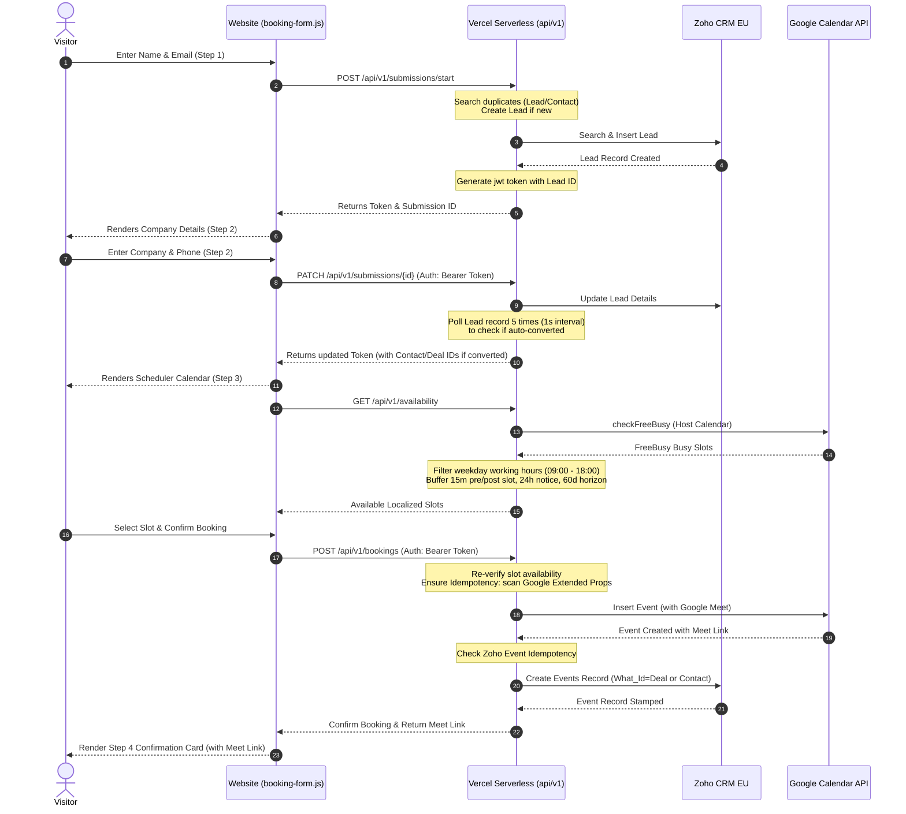

# Jurnii Booking Integration Architecture

This document describes the design, API contracts, and sync logic for the Jurnii Website Booking Form Integration with Zoho CRM and Google Calendar.

## High-Level Workflow

## Progressive State Management

Because Jurnii does not use a persistent database for front-end sessions, all step continuity is cryptographically secured using JWT tokens issued by the serverless backend.

1. **Step 1 (`/api/v1/submissions/start`)**:
   - Generates a Lead record in Zoho CRM if the email is not already associated with a Lead or Contact.
   - Signs and returns a JWT token containing:
     - `leadId`
     - `contactId` (null)
     - `step`: 1
     - `email`
     - `submissionId` (either custom module ID or fallback `MOCK_SUBMISSION_ID`)

2. **Step 2 (`/api/v1/submissions/{id}`)**:
   - Accepts the JWT token in the `Authorization: Bearer <token>` header.
   - Updates the Lead or Contact details in Zoho CRM.
   - If a Lead was updated, the endpoint polls the Lead record up to 5 times (with 1-second intervals) checking for the `Is_Converted` flag. This allows it to automatically resolve and capture any `Converted_Contact` or `Converted_Deal` lookup IDs that were generated asynchronously by Zoho workflows.
   - Signs and returns an updated JWT token containing resolved IDs.

3. **Step 3 (`/api/v1/bookings`)**:
   - Accepts the JWT token in the `Authorization: Bearer <token>` header.
   - Inserts the event on Google Calendar, requesting a Google Meet link.
   - Maps the event to Zoho CRM under the corresponding Deal (`What_Id`) or Contact (`Who_Id`).

## Idempotency Rules

To prevent duplicate calendar invitations and Zoho Event records in case of network retries or page refreshes:

- **Google Calendar**: The Google Calendar event stores the `submissionId` inside private extended properties (`privateExtendedProperty: 'submissionId=SUB_...'`). Before inserting any event, the API performs a list query filtering on this property.
- **Zoho CRM**: The Zoho Event record stores the `submissionId` in the custom field `Ext_Calendar_Booking_ID`. The API searches for an existing Event with this ID before calling the insert API.

## Local Timezone Handling

- Host working hours are evaluated in the host's target timezone (09:00 - 18:00, Monday to Friday).
- Dynamic slots returned by `/api/v1/availability` are ISO string timestamps.
- The frontend `booking-form.js` converts the ISO timestamps into the visitor's local timezone (e.g., GMT/CET/EST) using `date.toLocaleTimeString()` and `date.toLocaleDateString()` for a personalized client experience.
